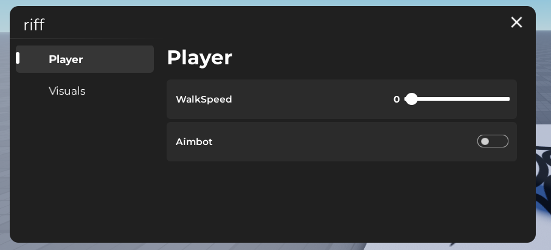

> riff (roblox interface framework) 

like a guitar riff, but worse... 

---

<h3 align="center">riff documentation</h3>
<p align="center">easy-to-use ui framework.</p>



<h3 align="left">create a window</h3>
<p>set up a new window for your ui.</p>

```lua
local riff = loadstring(game:HttpGet("https://raw.githubusercontent.com/sdhhf1245/riff/refs/heads/main/riff.lua"))()

local win = riff:Create({
    Name = "riff" -- window name
})
```

<h3 align="left">create a tab</h3>
<p>add a tab to your window to organize things.</p>

```lua
local plr = win:Tab({
    Name = "Player", -- tab name
    Icon = "rbxassetid://123456" -- tab icon
})
```

<h3 align="left">create a slider</h3>
<p>sliders let users pick a value from a range.</p>

```lua
plr:Slider({
    Name = "WalkSpeed", -- slider name
    Default = 16, -- default value
    Min = 0, -- min value
    Max = 109, -- max value
    Callback = function(v) -- what happens when the slider is used
        LocalPlayer.Character.Humanoid.WalkSpeed = v
    end
})
```

<h3 align="left">create a toggle</h3>
<p>toggles are for simple on/off options.</p>

```lua
plr:Toggle({
    Name = "Aimbot", -- toggle name
    DefaultState = false, -- default state (false = off)
    Callback = function(v) -- what happens when the toggle is used
        if v then
            print("aimbot on")
        else
            print("aimbot off")
        end
    end
})
```

<h3 align="left">create a dropdown</h3>
<p>dropdowns let users pick an option from a list.</p>

```lua
plr:Dropdown({
    Name = "ESP", -- dropdown name
    Items = {"Option 1", "Option 2", "Option 3", "Option 4", "Option 5"}, -- options list
    Default = "Option 1", -- default option
    Callback = function(selected) -- what happens when an option is selected
        print("selected esp type: " .. selected)
    end
})
```

<h3 align="left">create a section</h3>
<p>sections are for organizing your ui into chunks.</p>

```lua
plr:Section({
    Text = "Shooter" -- section title
})
```

<h3 align="left">complete example</h3>

```lua
local Players = game:GetService("Players")
local LocalPlayer = Players.LocalPlayer
local riff = loadstring(game:HttpGet("https://raw.githubusercontent.com/sdhhf1245/riff/refs/heads/main/riff.lua"))() 

local win = riff:Create({
    Name = "riff"
})

local plr = win:Tab({
    Name = "Player",
    Icon = "rbxassetid://123456"
})

plr:Slider({
    Name = "WalkSpeed",
    Default = 16,
    Min = 0,
    Max = 100000,
    Callback = function(v)
        LocalPlayer.Character.Humanoid.WalkSpeed = v
    end
})

plr:Section({
    Text = "Shooter"
})

plr:Toggle({
    Name = "Aimbot",
    DefaultState = false,
    Callback = function(v) if v then 
        print("on") 
    else print("off") 
    end 
end
})

plr:Dropdown({
    Name = "ESP",
    Items = {"Option 1", "Option 2", "Option 3", "4", "5", "6", "7", "8"},
    Default = "Option 1",
    Callback = function(selected)
        print("esp type: " .. selected)
        
    end
})
```

<p>make an issue to request a feature and i'll add it</p>
